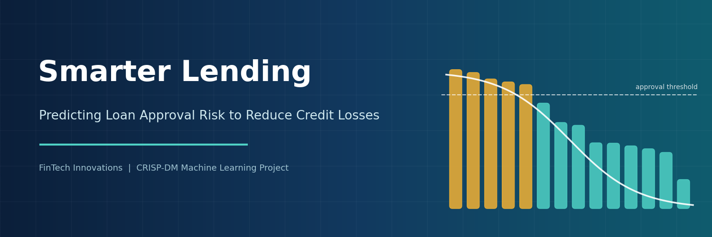

# Smarter Lending: Predicting Loan Approval Risk to Reduce Credit Losses

A cost-sensitive machine learning pipeline that supports loan approval decisions for a fictional lender, FinTech Innovations, built following the CRISP-DM framework.

## Overview

Approving a loan that defaults costs about $50,000, while denying a creditworthy applicant forfeits about $8,000 in profit. This project builds a classification model that minimizes the total dollar cost of lending errors rather than maximizing accuracy.

On 4,000 held-out applicants, the final cost-sensitive logistic regression model:

| Metric | Result |
|---|---|
| Total cost of errors | $4.51M (41% lower than denying all applicants) |
| Precision on approvals | 0.961 |
| Recall on approvals | 0.548 |
| ROC-AUC | 0.969 |

Total debt-to-income ratio and annual income are the strongest drivers of approval decisions.

## Approach

1. **Business Understanding**: defined a custom business-cost metric from the asymmetric error costs.
2. **Data Understanding**: explored 20,000 applications; identified missing values, text-formatted income, target leakage, and skewed financial features.
3. **Data Preparation**: built a `Pipeline` with a `ColumnTransformer` (numeric, log-transformed, ordinal, and one-hot flows) and a `FeatureUnion` with missing-value indicators. Excluded leakage features and protected attributes (age, marital status) and an age proxy.
4. **Modeling**: compared a deny-all baseline, logistic regression, and random forest with 5-fold stratified cross-validation. Tuned with `GridSearchCV` and `RandomizedSearchCV`, selecting models on business cost.
5. **Evaluation**: tested on a held-out set, analyzed performance across segments, and checked approval-rate disparities across age and marital status.
6. **Deployment recommendations**: decision-support use, pilot testing, fair-lending review, and ongoing monitoring.

**Key insight:** standard `class_weight='balanced'` doubled business cost. Cost-sensitive class weights matching the 6.25:1 cost ratio cut cost by nearly half.

## Repository Contents

| File | Description |
|---|---|
| `loan_approval_analysis.ipynb` | Full technical notebook |
| `financial_loan_data.csv` | Working dataset (20,000 applications, with data quality issues) |
| `Loan.csv` | Clean reference version of the same data |
| `Loan_Approval_Model_Report.docx` | Executive report for business stakeholders |
| `images/banner.png` | Project banner |
| `requirements.txt` | Python dependencies |

## How to Run

```bash
git clone https://github.com/<your-username>/<your-repo-name>.git
cd <your-repo-name>
pip install -r requirements.txt
jupyter notebook loan_approval_analysis.ipynb
```

Run all cells from top to bottom. The randomized search takes about 2 minutes.

## Limitations

- The target reflects historical approval decisions, not actual loan repayment.
- Approval rates differ across age groups through age-correlated financial features; this would require fair-lending review before real-world use.
- The dataset appears synthetic; real-world performance may differ.

## Tools

Python, pandas, NumPy, scikit-learn, matplotlib, seaborn
